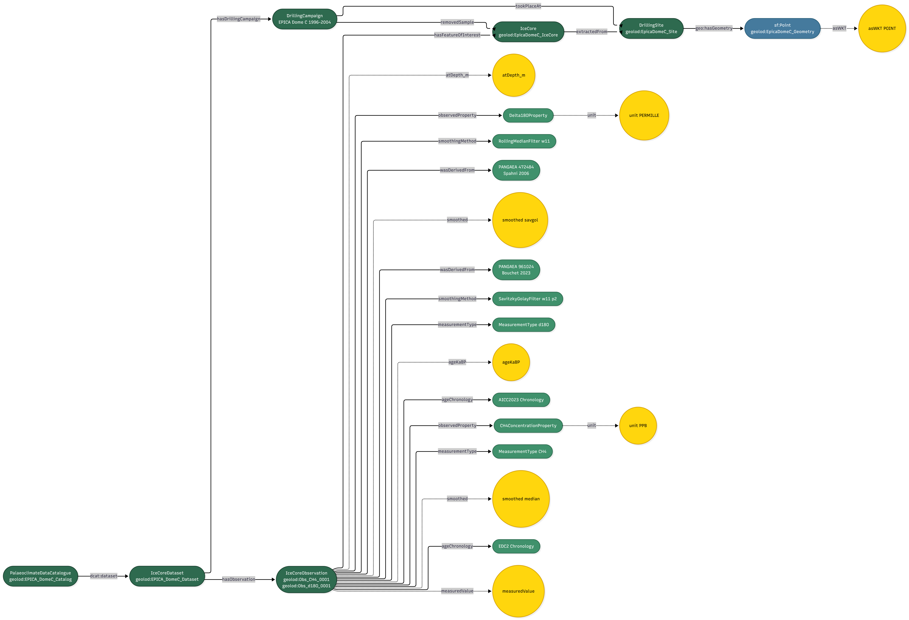

# GeoSciece-FAIRification-LOD: Palaeoclimate Data Processing Pipeline


A comprehensive Python pipeline for processing and FAIRifying palaeoclimate data from EPICA (European Project for Ice Coring in Antarctica) ice cores and SISAL (Speleothem Isotopes Synthesis and AnaLysis) speleothem databases. The tool generates publication-ready visualizations, converts raw data into RDF/Linked Open Data following FAIR principles, and produces interactive Mermaid diagrams of the ontology structure. It implements a GeoSPARQL-compliant ontology extending SOSA (Sensor, Observation, Sample, and Actuator), harmonizes EPICA ice core observations (CH₄, δ¹⁸O) with SISAL speleothem isotope data (δ¹⁸O, δ¹³C), and provides 306 georeferenced palaeoclimate sites as a unified FeatureCollection. The pipeline outputs 192,428 RDF triples across multiple files, enabling SPARQL queries for integrated palaeoclimate research spanning up to 805,000 years. SISAL cave sites and CI findspots can be typed as archaeological sites (`geolod:ArchaeologicalCaveSite`, `geolod:CIArchaeologicalSite`) and are linked to Wikidata via `owl:sameAs`.

[](https://doi.org/10.5281/zenodo.18814640)

# EPICA + SISAL Palaeoclimate Data Processing

Pipeline for generating plots, RDF/Linked Open Data, and Mermaid visualisations from EPICA and SISAL palaeoclimate data.

## 📁 Structure

```
project/
├── main.py                       ← MAIN SCRIPT (run everything)
├── pipeline_report.txt           ← Execution log
│
├── EPICA/                        ← EPICA Dome C (ice core)
│   ├── plot_epica_from_tab.py
│   ├── plots/                    ← JPG + SVG diagrams
│   │   ├── ch4_vs_depth_full.jpg
│   │   ├── ch4_vs_age_ka_full.jpg
│   │   ├── d18o_vs_depth_full.jpg
│   │   └── ... (12 plots × 2 formats = 24 files)
│   ├── rdf/                      ← RDF/TTL files
│   │   ├── epica_ontology.ttl
│   │   ├── epica_dome_c.ttl
│   │   └── geo_lod_core.ttl      ← Shared core ontology
│   └── report/
│       └── report.txt
│
├── SISAL/                        ← SISAL (speleothems)
│   ├── plot_sisal_from_csv.py
│   ├── plots/                    ← JPG + SVG diagrams
│   │   ├── 144_botuvera_d18o_age_unsmoothed.jpg
│   │   ├── 145_corchia_d18o_age_unsmoothed.jpg
│   │   └── ... (24 plots × 2 formats = 48 files)
│   ├── rdf/                      ← RDF/TTL files
│   │   ├── sisal_ontology.ttl
│   │   ├── sisal_sites.ttl
│   │   ├── sisal_144_botuvera_data.ttl
│   │   ├── sisal_145_corchia_data.ttl
│   │   ├── sisal_140_sanbao_data.ttl
│   │   ├── sisal_275_buracagloriosa_data.ttl
│   │   └── sisal_all_data.ttl    ← Combined file
│   └── report/
│       └── report.txt
│
├── CI/                           ← Campanian Ignimbrite findspots
│   ├── ci_pipeline.py
│   ├── rdf/                          ← RDF/TTL files
│   │   ├── ci_findspots.ttl
│   │   └── geo_lod_ci.ttl            ← CI ontology extension
│   └── report/
│       └── report.txt
│
├── ontology/                     ← Shared ontology utilities
│   ├── geo_lod_utils.py          ← Core functions + Mermaid generation
│   ├── geo_lod_core.ttl          ← Base ontology (generated)
│   ├── mermaid_taxonomy.mermaid  ← Class hierarchy diagram
│   ├── mermaid_instance_epica.mermaid  ← EPICA instances
│   ├── mermaid_instance_sisal.mermaid  ← SISAL instances
│   └── mermaid_instance_ci.mermaid      ← CI instances
│
├── img/                          ← Documentation images
│   ├── logo.png
│   ├── taxonomy.png              ← Ontology class hierarchy
│   ├── instance_epica.png        ← EPICA RDF model
│   └── instance_sisal.png        ← SISAL RDF model
│
├── data/                         ← Input data (Tab/CSV)
│   ├── EDC_CH4.tab
│   ├── EPICA_Dome_C_d18O.tab
│   ├── v_data_144_botuvera.csv
│   ├── v_data_145_corchia.csv
│   ├── v_data_140_sanbao.csv
│   ├── v_data_275_buracagloriosa.csv
│   └── v_sites_all.csv           ← All 305 SISAL sites
│
├── README.md
└── LICENSE
```

## 🚀 Usage

### Run everything (recommended)

```bash
python main.py
```

This executes:
1. ✓ EPICA Dome C — 12 plots + RDF/TTL + Mermaid diagrams
2. ✓ SISAL — 24 plots + RDF/TTL for 4 caves (305 sites metadata, incl. archaeological sites)
2. ✓ CI — Campanian Ignimbrite findspots → RDF/TTL (incl. archaeological sites)
3. ✓ Shared ontology (`geo_lod_core.ttl`) with 4 Mermaid diagrams
4. ✓ Complete log saved to `pipeline_report.txt`

**Duration:** ~45-60 seconds

### Clean outputs before running

```bash
python main.py --clean
```

Removes all generated files (plots, RDF, Mermaid, reports, Python cache) before execution.

### EPICA only

```bash
python main.py --epica-only
```

### SISAL only

```bash
python main.py --sisal-only
```

## 📊 Output

### Plots (JPG + SVG)

**EPICA Dome C (12 plots):**
- `ch4_vs_depth_full.{jpg,svg}` — CH₄ by depth (m)
- `ch4_vs_age_ka_full.{jpg,svg}` — CH₄ by age (ka BP)
- `d18o_vs_depth_full.{jpg,svg}` — δ¹⁸O by depth (m)
- `d18o_vs_age_ka_full.{jpg,svg}` — δ¹⁸O by age (ka BP)

Variants: `full`, `full_smooth11`, `full_savgol11p2`

**SISAL (24 plots for 4 caves):**
- Botuverá cave (144) — 6 plots
- Antro del Corchia (145) — 6 plots
- Sanbao cave (140) — 3 plots (δ¹⁸O only)
- Buraca Gloriosa (275) — 6 plots

Format: `{site_id}_{cave}_{isotope}_age_{variant}.{jpg,svg}`

### RDF/Linked Open Data (TTL)

**Core Ontology:**
- `ontology/geo_lod_core.ttl` — Shared base classes (PalaeoclimateObservation, SamplingLocation, etc.)

**EPICA:**
- `EPICA/rdf/epica_ontology.ttl` — EPICA-specific classes (IceCoreObservation, DrillingSite, etc.)
- `EPICA/rdf/epica_dome_c.ttl` — Data (1 site, 2,114 observations: 736 CH₄ + 1,378 δ¹⁸O)
- **40,259 triples total**

**SISAL:**
- `SISAL/rdf/sisal_ontology.ttl` — SISAL-specific classes (SpeleothemObservation, Cave, etc.)
- `SISAL/rdf/sisal_sites.ttl` — All 305 SISAL caves with WGS84 geometries and archaeological enrichment (3,663 triples)
- `SISAL/rdf/sisal_144_botuvera_data.ttl` — 907 δ¹⁸O + 907 δ¹³C observations (21,795 triples)
- `SISAL/rdf/sisal_145_corchia_data.ttl` — 1,234 δ¹⁸O + 1,234 δ¹³C observations (29,651 triples)
- `SISAL/rdf/sisal_140_sanbao_data.ttl` — 5,832 δ¹⁸O observations (70,075 triples)
- `SISAL/rdf/sisal_275_buracagloriosa_data.ttl` — 1,137 δ¹⁸O + 1,137 δ¹³C observations (27,327 triples)
- `SISAL/rdf/sisal_all_data.ttl` — Combined file (**152,169 triples total**)


**CI (Campanian Ignimbrite):**
- `CI/rdf/geo_lod_ci.ttl` — CI ontology extension (CIFindspot, CIArchaeologicalSite, etc.)
- `CI/rdf/ci_findspots.ttl` — Findspot data with GeoSPARQL geometries and PROV-O provenance

### Mermaid Diagrams (Ontology Visualisation)

All diagrams generated in `ontology/`:

- **`mermaid_taxonomy.mermaid`** — Complete class hierarchy (Core + EPICA + SISAL)
  - Includes external ontologies (SOSA, GeoSPARQL, DCAT, PROV)
  - LR (left-right) layout for readability
  
- **`mermaid_instance_epica.mermaid`** — EPICA named individuals
  - EPICA Dome C site, ice core sample, chronology
  - Green color scheme (#d4edda)
  
- **`mermaid_instance_sisal.mermaid`** — SISAL named individuals
  - 305 cave sites, FeatureCollections, archaeological cave sites
  - Yellow/brown color scheme (#fff3cd)

- **`mermaid_instance_ci.mermaid`** — CI named individuals
  - Campanian Ignimbrite volcanic event, findspots, archaeological sites
  - Terracotta color scheme (#fce8d5)

**Rendering to PNG:**
```bash
# Install Mermaid CLI
npm install -g @mermaid-js/mermaid-cli

# Generate PNG images
mmdc -i ontology/mermaid_taxonomy.mermaid -o img/taxonomy.png
mmdc -i ontology/mermaid_instance_epica.mermaid -o img/instance_epica.png
mmdc -i ontology/mermaid_instance_sisal.mermaid -o img/instance_sisal.png
mmdc -i ontology/mermaid_instance_ci.mermaid -o img/instance_ci.png
```

## 🖼️ RDF Model Visualisations

### Ontology Taxonomy


*Complete class hierarchy showing Core, EPICA, and SISAL classes with external ontology integration (SOSA, GeoSPARQL, DCAT, PROV)*

### EPICA Instance Model



*EPICA Dome C drilling site with ice core sample, observations, and chronology*

### SISAL Instance Model


*SISAL cave sites (305 caves) organized in GeoSPARQL FeatureCollections*

## 🔍 SPARQL Queries

After export, you can load the TTL files into a triplestore (e.g., Apache Jena Fuseki, GraphDB) and query them:

### All Sites (EPICA + SISAL)

```sparql
PREFIX geolod: <http://w3id.org/geo-lod/>
PREFIX geo: <http://www.opengis.net/ont/geosparql#>
PREFIX rdfs: <http://www.w3.org/2000/01/rdf-schema#>

SELECT ?site ?label ?wkt
WHERE {
  ?collection rdfs:member ?site .
  ?site rdfs:label ?label ;
        geo:hasGeometry/geo:asWKT ?wkt .
}
```

Result: 306 sites (1 EPICA + 305 SISAL)

### EPICA CH₄ Observations

```sparql
PREFIX geolod: <http://w3id.org/geo-lod/>
PREFIX sosa: <http://www.w3.org/ns/sosa/>

SELECT ?obs ?age ?value ?smoothed
WHERE {
  ?obs a geolod:CH4Observation ;
       geolod:ageKaBP ?age ;
       geolod:measuredValue ?value ;
       geolod:smoothedValue_rollingMedian ?smoothed .
}
ORDER BY ?age
```

Result: 736 observations

### SISAL Sites with Sample Counts

```sparql
PREFIX geolod: <http://w3id.org/geo-lod/>

SELECT ?cave ?name ?d18o_count ?d13c_count
WHERE {
  ?cave a geolod:Cave ;
        rdfs:label ?name ;
        geolod:countD18OSamples ?d18o_count ;
        geolod:countD13CSamples ?d13c_count .
}
ORDER BY DESC(?d18o_count)
```

Result: 305 caves with sample counts

## 🛠️ Dependencies

```bash
pip install numpy pandas matplotlib scipy rdflib
```

**Optional (for Mermaid PNG rendering):**
```bash
npm install -g @mermaid-js/mermaid-cli
```

## 📝 Ontology Overview

### Class Hierarchy

```
geolod:PalaeoclimateObservation
  ├── geolod:IceCoreObservation (EPICA)
  │     ├── geolod:CH4Observation
  │     └── geolod:Delta18OObservation
  └── geolod:SpeleothemObservation (SISAL)
        ├── geolod:Delta18OSpeleothemObservation
        └── geolod:Delta13CSpeleothemObservation

geolod:SamplingLocation
  ├── geolod:DrillingSite (EPICA)
  ├── geolod:Cave (SISAL)
  │     └── geolod:ArchaeologicalCaveSite
  └── geolod:CIFindspot (CI)
        └── geolod:CIArchaeologicalSite

geolod:PalaeoclimateSample
  ├── geolod:IceCore (EPICA)
  └── geolod:Speleothem (SISAL)

geolod:Chronology
  ├── geolod:IceCoreChronology (EPICA — EDC2, AICC2023)
  └── geolod:UThChronology (SISAL)
```

### FeatureCollections (GeoSPARQL)

- `geolod:EPICA_DrillingSite_Collection` — 1 member
- `geolod:SISAL_Cave_Collection` — 305 members
- `geolod:SISAL_ArchaeologicalCave_Collection` — 37 members
- `geolod:AllPalaeoclimateSites_Collection` — 306 members
- `geolod:CIFindspotCollection` — CI findspots

## 🌐 W3ID URIs

All resources use persistent W3ID.org URIs:

- Namespace: `http://w3id.org/geo-lod/`
- Example site: `http://w3id.org/geo-lod/EpicaDomeC_Site`
- Example observation: `http://w3id.org/geo-lod/Obs_CH4_epica_00001`

## 📈 Statistics

### EPICA Dome C
- **1 drilling site** (75.1°S, 123.4°E, Antarctica)
- **2,114 observations** (736 CH₄ + 1,378 δ¹⁸O)
- **Time span:** 0–805.8 ka BP
- **Depth range:** 99.3–3,191.1 m
- **40,259 RDF triples**

### SISAL
- **305 cave sites** worldwide (37 typed as `geolod:ArchaeologicalCaveSite`, 27 with Wikidata `owl:sameAs`, 7 UNESCO World Heritage)
- **9,110 observations** in 4 example caves (Botuverá, Corchia, Sanbao, Buraca Gloriosa)
- **318,870 total δ¹⁸O samples** across all 305 sites (metadata only)
- **220,224 total δ¹³C samples** across all 305 sites (metadata only)
- **152,169 RDF triples** (sites + 4 caves data)

## 📖 Literature

**EPICA:**
- Lüthi et al. (2008): High-resolution carbon dioxide concentration record 650,000-800,000 years before present. *Nature* 453, 379-382. https://doi.org/10.1038/nature06949
- Loulergue et al. (2008): Orbital and millennial-scale features of atmospheric CH₄ over the past 800,000 years. *Nature* 453, 383-386. https://doi.org/10.1038/nature06950

**SISAL:**
- Kaushal et al. (2024): SISALv3: a global speleothem stable isotope and trace element database. *Earth System Science Data* 16, 1933-1963. https://doi.org/10.5194/essd-16-1933-2024

**MIS Boundaries:**
- Lisiecki & Raymo (2005): A Plio-Pleistocene stack of 57 globally distributed benthic δ¹⁸O records. *Paleoceanography* 20, PA1003. https://doi.org/10.1029/2004PA001071

## 🐛 Troubleshooting

### Import Error: `geo_lod_utils not found`

The scripts automatically set `PYTHONPATH` to include the `ontology/` directory. If you still get import errors:

1. **Check structure:**
   ```
   project/
   ├── main.py
   ├── EPICA/
   │   └── plot_epica_from_tab.py
   ├── SISAL/
   │   └── plot_sisal_from_csv.py
   └── ontology/
       └── geo_lod_utils.py  ← must be here!
   ```

2. **Run via main.py** (not individual scripts):
   ```bash
   python main.py
   ```

### No Mermaid diagrams generated

If `ontology/*.mermaid` files are missing:
- Check `pipeline_report.txt` for import errors
- Ensure `geo_lod_utils.py` is in `ontology/` directory
- Run with `--clean` flag: `python main.py --clean`

### No data found

→ Check if input files are in the `data/` folder:
```bash
ls data/*.tab data/*.csv
```

Required files:
- `EDC_CH4.tab`
- `EPICA_Dome_C_d18O.tab`
- `v_sites_all.csv`
- `v_data_144_botuvera.csv`
- `v_data_145_corchia.csv`
- `v_data_140_sanbao.csv`
- `v_data_275_buracagloriosa.csv`

### RDF export not working

→ Install rdflib:
```bash
pip install rdflib
```

## 🤝 Author

**Florian Thiery**  
ORCID: https://orcid.org/0000-0002-3246-3531

## 📄 Licence

CC BY 4.0 — https://creativecommons.org/licenses/by/4.0/